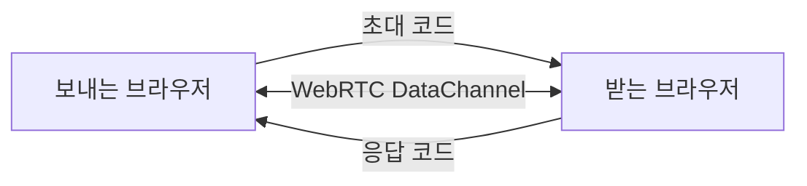

# 웹 MVP 설계와 제약

## 목표

OpenFileTransfer Web은 앱 설치 없이 브라우저만으로 파일을 주고받는 흐름을 검증합니다. Vercel에는 정적 HTML/CSS/JS만 배포하고, 실제 파일은 WebRTC DataChannel로 디바이스 간 직접 전송합니다.

## UPnP/SSDP를 넣지 않는 이유

브라우저 JavaScript는 UDP multicast socket을 열 수 없어서 SSDP `M-SEARCH`를 보낼 수 없습니다. 로컬 네트워크 스캔이나 임의 포트 연결도 브라우저 보안 정책, CORS, Local Network Access 정책의 영향을 받습니다.

따라서 웹 버전은 네이티브 앱의 자동 탐색 구조와 다르게 갑니다.

- 네이티브 앱: SSDP/UPnP 탐색, gRPC 직접 연결, 백그라운드 수신
- 웹 앱: 초대 코드/응답 코드, WebRTC P2P, 브라우저 탭 활성 상태 중심

## 현재 구현

- 브라우저별 UUID와 디바이스 이름 저장
- 초대 코드/응답 코드 기반 WebRTC 연결
- 초대 코드 공유 링크 자동 입력과 QR 표시
- Nearby 방 참여, 온라인 디바이스 목록, 연결 요청/수락
- 여러 파일 선택과 순차 전송 큐
- 수신 파일 목록과 개별 저장 버튼
- 진행률, 이벤트 로그, 전송 중지
- 선택 전송 암호 기반 AES-GCM 청크 암호화
- 지원 브라우저의 QR 스캔
- File System Access API 기반 수신 파일 바로 저장
- 사용자 TURN 서버 설정
- 로컬 전송 이력 저장

## 연결 구조

초대 코드와 응답 코드는 WebRTC SDP 정보를 base64url로 감싼 값입니다. 두 코드가 교환된 뒤 브라우저는 ICE 후보를 이용해 직접 연결을 시도합니다. 공유 링크는 URL hash에 코드를 담기 때문에 Vercel 서버 로그로 코드가 전달되지 않습니다.

## Vercel의 역할

Vercel은 앱 파일을 배포하고, Nearby 방 기능을 위한 짧은 presence/signaling API를 제공합니다. 파일 데이터, 파일 이름, 파일 내용은 Vercel API로 업로드하지 않습니다.

Nearby 방 기능에서는 Vercel Function이 Runtime Cache에 디바이스 heartbeat와 WebRTC offer/answer 메시지를 짧게 저장합니다. 저장되는 값은 디바이스 ID/이름, 마지막 접속 시간, 연결용 SDP 코드입니다. 파일 데이터는 저장하지 않습니다.

더 안정적인 자동 매칭을 넣고 싶다면 별도 signaling 저장소가 필요합니다.

- 현재안: Vercel API + Runtime Cache polling
- 확장안: Vercel API + 외부 DB 또는 KV
- 안정안: Supabase Realtime, Ably, Pusher, PartyKit
- 자체운영안: 작은 WebSocket signaling 서버

Vercel Functions는 WebSocket 서버로 오래 연결을 유지하는 용도에는 맞지 않습니다.

## 보안

- WebRTC DataChannel은 DTLS 기반 암호화를 사용합니다.
- `전송 암호`를 입력하면 파일 청크를 AES-GCM으로 추가 암호화합니다.
- 전송 암호는 브라우저 밖으로 전송하지 않습니다.
- PBKDF2-SHA-256으로 AES-256-GCM 키를 파생합니다.
- TURN 설정은 브라우저 localStorage에 저장하며, 직접 연결이 어려운 네트워크에서 ICE relay 후보를 추가하는 용도입니다.
- 초대/응답 코드를 제3자가 보면 연결 시도가 가능하므로 코드는 같은 사용자 흐름 안에서만 공유해야 합니다.

## 현재 제약

- 브라우저 탭이 닫히면 전송이 중단됩니다.
- `수신 파일 바로 저장`을 켜고 브라우저가 File System Access API를 지원하면 수신 청크를 파일로 바로 씁니다.
- 바로 저장을 사용할 수 없는 브라우저는 Blob으로 메모리에 모은 뒤 저장합니다.
- 매우 큰 파일은 브라우저별 저장 API와 메모리 제약을 받을 수 있습니다.
- NAT/방화벽 환경에 따라 직접 연결이 실패할 수 있습니다.
- TURN 서버 설정은 UI로 제공하지만, 실제 relay 품질은 사용자가 입력한 TURN 서버 상태에 좌우됩니다.
- 모바일 브라우저는 백그라운드 전송 안정성이 낮습니다.
- Runtime Cache는 영구 DB가 아니라 짧은 presence/signaling용 캐시입니다. 방 목록과 연결 요청은 만료될 수 있습니다.
- QR 스캔은 브라우저의 BarcodeDetector/camera 지원 여부에 따라 동작합니다.

## 다음 후보 작업

1. 외부 realtime signaling을 붙인 방 코드 자동 매칭
2. TURN 서버 계정 발급과 네트워크별 relay 품질 테스트
3. PWA 설치/오프라인 캐시
4. 전송 재시도/이어받기
